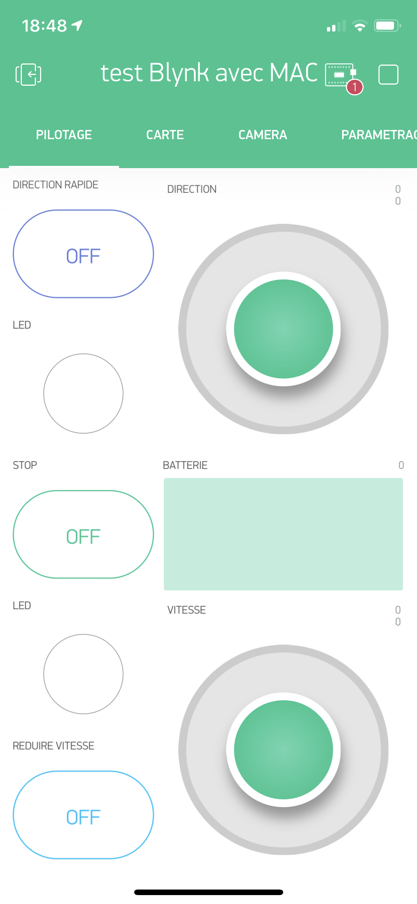

# MonsterBorg-Blynk
Voiture électrique de type Monsterborg contrôlée via l'APP Blynk.

Ce projet consiste à regrouper différentes technologies pour piloter un véhicule électrique grâce à une application simple 
sous iPhone/Android.

Il doit permettre de mieux comprendre le développement de logociel basé sur des technologies IoT, Cloud et d’App pour 
smartphone. Le véhicule doit être piloté à distance grâce aux réseaux Wifi, 3/4G ou éventuellement 5G plus tard. 
Une solution de vidéo à distance doit permettre de visualiser la route et converser avec des personnes sur le chemin.

# Véhicule : PiBorg MonsterBorg
Ce « buggy » est reconnu comme la solution la plus robuste et intéressante pour des projets de développements avec le Raspberry Pi. Il est solide et dispose de 4 puissants moteurs. Une librairie Python et C++ est disponible pour Raspberry ou Arduino.

https://www.piborg.org/robots-1/monsterborg

# Cartes de contrôle des moteurs : PiBorg ThunderBorg
La carte ThunderBorg de PiBorg permet de gérer 4 moteurs avec une puissance de sortie de 7 à 35V sous 5A.

https://www.piborg.org/motor-control-1135/thunderborg

# Assemblage MonsterBorg

L’assemblage du MonsterBorg est décrit sous :
    https://www.piborg.org/blog/monsterborg-build-instructions

# Configuration du Raspberry Pi 4
Mise à jour du Raspberry Pi 4 avec les dernières versions logicielles :

    sudo apt-get update
    sudo apt-get full-upgrade

Pour changer la version Python 2.x en version 3.x par défaut, ajouter la ligne suivante
en haut du fichier bashrc

    Open ~/.bashrc
    alias python='/usr/bin/python3.7'
    $ . ~/.bashrc
    
Et contrôler la version par défaut :

    $ python --version
    Python 3.7
   
# Configuration de la carte ThunderBorg avec Raspberry Pi 4
Suivre la procédure de préparation du Raspberry et ThunderBorg .
    https://www.piborg.org/blog/monsterborg-getting-started

Attention, la librairie est écrite pour Python 2. Pour Python 3, il faut mettre à jour la librairie ThunderBorg avec les commandes suivantes :

    cd ~/thunderborg
    wget -O ThunderBorg3.py
    http://forum.piborg.org/downloads/thunderborg/ThunderBorg3.py.txt

modifier le programme python en remplacant :

    import ThunderBorg
par

    import ThunderBorg3 as ThunderBorg
    
Montage de la carte ThunderBorg: 
    https://www.piborg.org/blog/monsterborg-getting-started
    
# PROGRAMMATION
Blynk APP : L’application utilisée pour télécommander le MonsterBorg est basée sur Blynk.

Variante avec joystick (valeur analogique)

